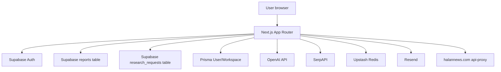

# Architecture

## Verified stack

- Framework: Next.js, React, TypeScript.
- Database/auth: Supabase plus Prisma/PostgreSQL.
- AI: OpenAI SDK and a legacy AI provider abstraction.
- Search: SerpAPI for Lead Finder search.
- Cache/rate-limit/quota: Upstash Redis, fail-open in several paths.
- Email: Resend in demo routes.
- Deployment target: Vercel, based on `vercel.json`.

## Verified high-level architecture

## Verified data architecture

Two database models coexist:

- Prisma models in `prisma/schema.prisma`: `User`, `Workspace`, plus `Report` and `ApiUsage` explicitly marked LEGACY.
- Supabase SQL tables in `supabase/`: `reports`, `research_requests`, `user_plans`, `demo_leads`.

Current reports are stored in the Supabase `reports` table, not the Prisma `Report` model. This is stated in the Prisma schema comments and visible in active routes.

## Verified architectural risks

- Split data model: Prisma user/workspace and Supabase auth/reporting are both active.
- Legacy AI engine remains in `services/legacy-ai-engine` and is imported by the Research Core Engine for provider interfaces.
- Empty `app/api/debug-env/route.ts` breaks the production build.
- Next build warning: Next inferred workspace root from `/Users/ahmed/package-lock.json`, outside the repository.
- Turbopack warning: Prisma generated files cause broad tracing through `app/api/workspace/route.ts`.

## Not verified

- Production deployment topology: NOT VERIFIED.
- Vercel project environment configuration: NOT VERIFIED.
- Database migrations applied in production: NOT VERIFIED.
- Backup, restore, observability, and incident process: NOT VERIFIED.

